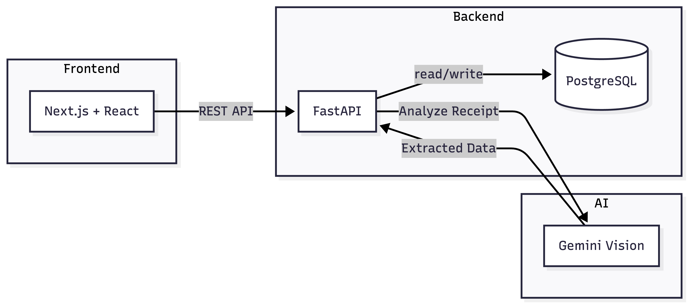
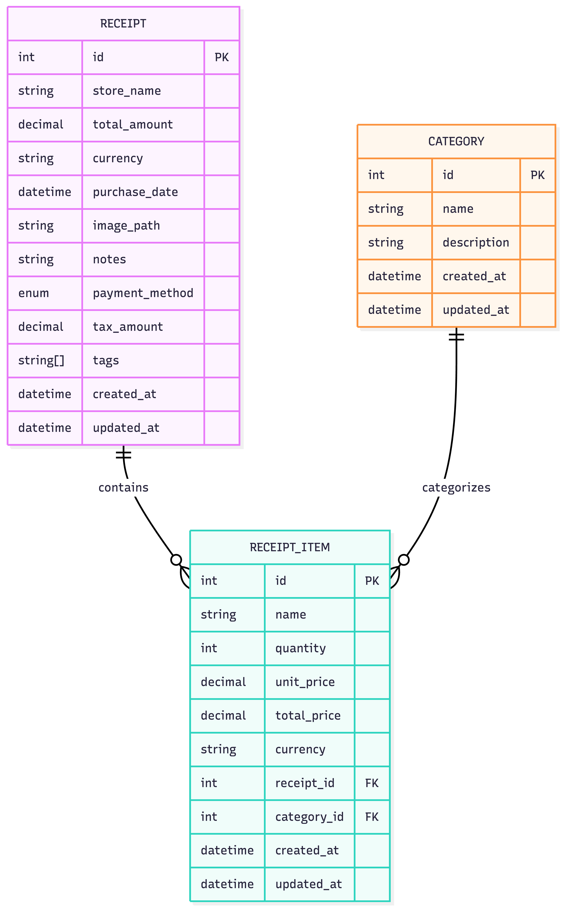

# Receipt Scanner

A full-stack receipt scanning application with AI-powered analysis. Upload receipts, extract items automatically, and track spending by category.

## Features

- **AI Receipt Scanning**: Upload receipt images, get items extracted automatically
- **Category Management**: Organize items with custom categories
- **Multi-Currency Support**: Track spending in EUR, GBP, USD with real-time conversion
- **Analytics Dashboard**: Monthly spending breakdown by category
- **Dark Mode**: Modern dark-first UI design

## Tech Stack

| Layer | Technology |
| ----- | ---------- |
| **Frontend** | Next.js 16, React 19, TanStack Query, Tailwind CSS, shadcn/ui |
| **Backend** | FastAPI, SQLModel, Pydantic AI, PostgreSQL |
| **AI** | Google Gemini Vision |

## Architecture



## Data Model



## Quick Start

```bash
# Clone and setup
git clone https://github.com/cgoncalves94/receipt-scanner.git
cd receipt-scanner
make setup

# Add your GEMINI_API_KEY to backend/.env

# Start services
make dev              # Terminal 1: Backend + DB
make dev-frontend     # Terminal 2: Frontend
```

- **Frontend**: <http://localhost:3000>
- **Backend API**: <http://localhost:8000>
- **API Docs**: <http://localhost:8000/docs>

## API Endpoints

| Method | Endpoint | Description |
| ------ | -------- | ----------- |
| `POST` | `/api/v1/receipts/scan` | Upload and analyze receipt |
| `GET` | `/api/v1/receipts` | List receipts (with filtering) |
| `GET` | `/api/v1/receipts/{id}` | Get receipt details |
| `PATCH` | `/api/v1/receipts/{id}` | Update receipt |
| `DELETE` | `/api/v1/receipts/{id}` | Delete receipt |
| `GET` | `/api/v1/categories` | List categories |
| `POST` | `/api/v1/categories` | Create category |
| `DELETE` | `/api/v1/categories/{id}` | Delete category |
| `GET` | `/api/v1/analytics/summary` | Spending summary |
| `GET` | `/api/v1/analytics/trends` | Spending trends |

See full API documentation at <http://localhost:8000/docs>

## Development

See [DEVELOPMENT.md](DEVELOPMENT.md) for detailed setup, commands, and architecture guide.

## License

See [LICENSE](LICENSE) file.
